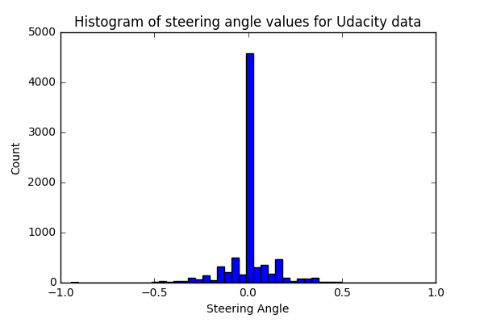
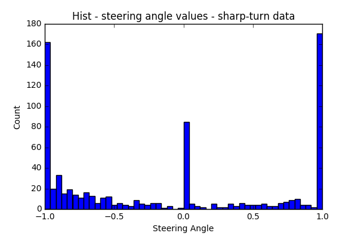
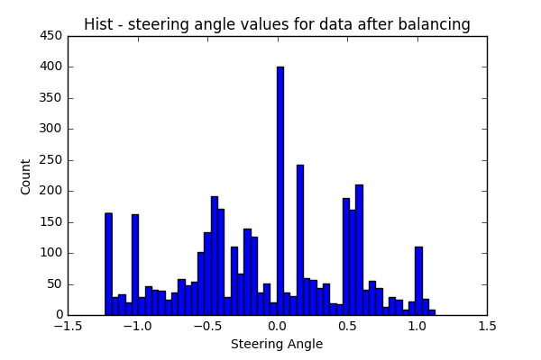
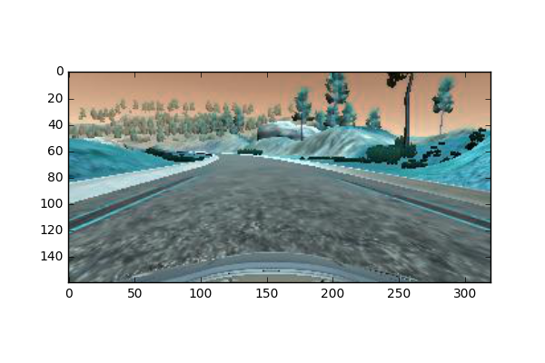
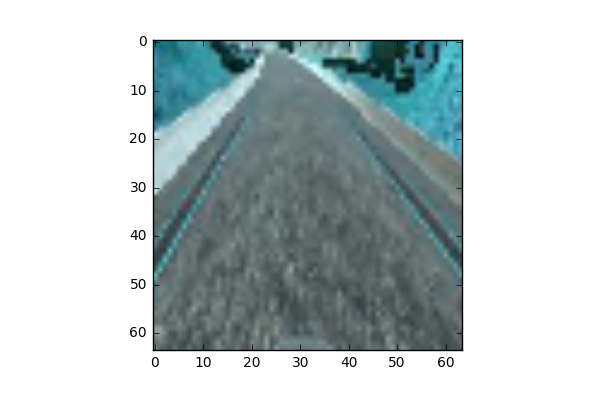
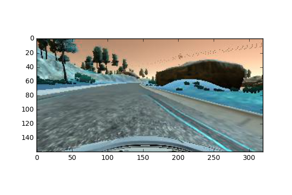
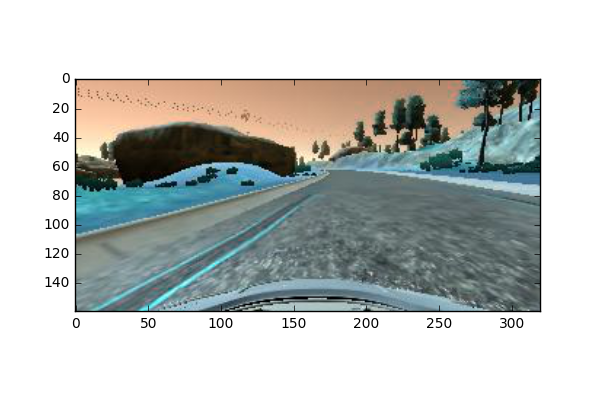
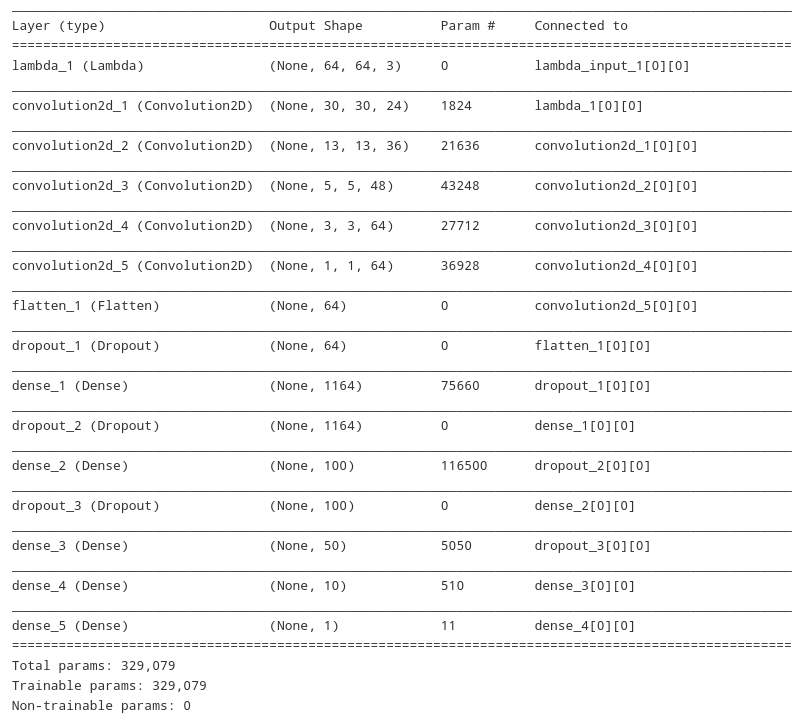

# Behavioral Cloning for Self Driving Cars

### Overview

This is the third project in the [SDC Engineer Nanodegree](https://www.udacity.com/course/self-driving-car-engineer-nanodegree--nd013 "SDC Engineer Nanodegree")  from [Udacity](https://www.udacity.com/ "Udacity"), where we train a deep learning model using raw-pixels from RGB images generated by 3 front-facing cameras installed on the front hood cover of the car, with the objective of predicting the steering angle. Driving a car is more complex than only how to steer the car: ideally, we would like the model to also deal with throttle, breaking and control speeds at specific segments of the road, but for the purpose of this project, we're only trying to model for the steering angle.

This README is structured as follows: 

* [Data: Sources, Exploration, Enrichment and Preprocessing](#section-0).
* [Generator Functions](#section-1) for the training and validation data.
* [Model Architecture and Training](#section-2) Description of the layers, overfitting methods, etc.
* [Results and Further Improvements](#section-3)

The model parameters file and a video of a full round in each track are provided.


### [Data: Sources, Exploration, Enrichment and Preprocessing](#section-0)

Two sources of data are used for training the model in this project. The first source is Udacity's own data. Each data point provides 3 images from three cameras at the front hood cover of the car (left, center and right), along with speed, throttle, break and steering angle.

This dataset is imbalanced since the majority of datapoints are within a small range from straight driving (within the range of -0.15 to 0.15). See the figure below for the histogram of steering angle values.Training the model using this source provided very unreliable results in the simulator.



Some ways to enrich the data with more left/right turn points is to record using manual driving in the simulator, and add a recovery angle to the images from the left/right camera and add them to the dataset as their own points.

For sharp turn data, I used [this small data set](https://github.com/cssomnath/udacity-sdc/blob/master/carnd-projects/CarND-Behavioral-Cloning/sharp_turn.zip "Sharp Turn data") recorded by another Udacity SDC student (Kudos to [Somnath Banerjee](https://github.com/cssomnath Somnath Banerjee)) and combined it with the Udacity data set, as recording data using keyboard/mouse does not capture angles smoothly. The histogram for the sharp-turn data is below.


```python
header_row = ['center', 'left', 'right', 'steering', 'throttle', 'brake', 'speed']
udacity_data = pd.read_csv('driving_log.csv', skiprows=[0], names=header_row)
sharp_turn_data = pd.read_csv('sharp_turn.csv')

# Combine the two data sources ...
data = pd.concat([udacity_data, sharp_turn_data])
```



After some trial-and-error, limiting the number of data points corresponding to steering-angle ranges, I ended up using a dataset containing 3871 images with the following histogram:



For further enrichment, we added a small-recovery angle (negative for lef camera images, and positive for right camera images) to the steering angle. The adjustment value is of value 0.20, and then we added the camera from left/right image with the adjusted angle to the data set.

Preprocessing happens in the following steps:

* Normalize the pixel values to be within the range of [-0.5 - 0.5], performed by a [Lambda Layer](https://keras.io/layers/core/#lambda "Lambda Layer") in the network.

* Crop the image to the area of interest, by removing the sky and the lower part of the image, then resize it to 64x64x3.

```python
def crop_resize(img):
    """
    :param img: original image
    :return: cropped: img - without the sky part, resized to fit the input
                        size requirement for the CNN
    """
    cropped = cv2.resize(img[60:140, :], (64, 64))
    return cropped

```

The two figures below shows an image from a center camera before and after cropping and resizing.





* Flipping images: Randomly mirror the image L->R or R->L and multiply the angle by -1, based on a coin flip. This is performed on the training data only by the generator, to enrich the dataset.

```python
def flip(img, steer_angle):
    """
    :param img: camera input
    :param steer_angle: steering angle
    :return: new_img: Flipped, along the y axis.
             new_angle: steer_angle multiplied by -1
    """
    new_img = cv2.flip(img, 1)
    new_angle = steer_angle*(-1)
    return new_img, new_angle
```
The following two images show the original image and the flipped image:




* Random Brightness changes: Used by the generator for training data only, to convert the image to HSV space and multiply the V channel with a random number from a uniform distribution in the range of [0.25 - 1.0] to make the model generalize to environments with different brightness levels.

```python

def random_brightness(img):
    """
    Convert the image to HSV, and multiply the brightness channel [:,:,2]
    by a random number in the range of [0.25 to 1.0] to get different levels of
    brightness.
    :param img: normalized image in RGB color space
    :return: new_img: Image in RGB Color space
    """
    hsv_img = cv2.cvtColor(img, cv2.COLOR_RGB2HSV)
    rand = random.uniform(0.25,1.0)
    hsv_img[:, :, 2] = rand*hsv_img[:, :, 2]
    new_img = cv2.cvtColor(hsv_img, cv2.COLOR_HSV2RGB)
    return new_img
```

The data was divited into 90% **training** and 10% **validation** sets, and then randomly shuffled. I think this split was not necessary at all, since the validation error is not reflective of the model's performance on the simulator's track. For example, in earlier trials I got lower validation error but very bad performance on the track, and my final working solution did not have the lowest validation error of all the trials.

### [Generator Functions](#section-1)

Instead of loading all the data into the RAM, Python generators will be used to load the data batch by batch of 200 images each. Two generator functions are used, one for training and one for validation.

##### Training Data Generator

The generator randomly chooses 200 (batch_size) images from the training set, and applies the preprocessing steps on each image. Each image is cropped, resized, and a random brightness information followed by a a flip (with 50% probability).

When 200 images are read, preprocessed and stored into the RAM, the generator yields these images with their angles to the model to perform the training.

```python
def generator_data(batch_size):
    batch_train = np.zeros((batch_size, 64, 64, 3), dtype=np.float32)
    batch_angle = np.zeros((batch_size,), dtype=np.float32)

    while True:
        data, angle = shuffle(X_train, y_train)
        for i in range(batch_size):
            choice = int(np.random.choice(len(data), 1))
            batch_train[i] = crop_resize(random_brightness(mpimg.imread(data[choice].strip())))
            batch_angle[i] = angle[choice] * (1 + np.random.uniform(-0.05, 0.05))
            flip_coin = random.randint(0, 1)
            if flip_coin == 1:
                batch_train[i], batch_angle[i] = flip(batch_train[i], batch_angle[i])
        yield batch_train, batch_angle

``` 

##### Validation Data Generator

The validation data generator works the same way as the training data generator, except for skipping the flipping and random-brightness adjustment operations. This is used to evaluate the model performance on the validation set during model building.

```python
def generator_valid(data, angle, batch_size):
    batch_train = np.zeros((batch_size, 64, 64, 3), dtype=np.float32)
    batch_angle = np.zeros((batch_size,), dtype=np.float32)
    while True:
        data, angle = shuffle(data, angle)
        for i in range(batch_size):
            rand = int(np.random.choice(len(data), 1))
            batch_train[i] = crop_resize(mpimg.imread(data[rand].strip()))
            batch_angle[i] = angle[rand]
        yield batch_train, batch_angle

```

### [Model Architecture and Training](#section-2)

The figure below shows the model architecture, which is inspired by the [End to End Learning for Self-Driving Cars](https://images.nvidia.com/content/tegra/automotive/images/2016/solutions/pdf/end-to-end-dl-using-px.pdf "NVIDIA Paper") with some modifications. First, the image is normalized by making the pixel values within the range [-0.5 to 0.5].

The main modifications are:

- Input size: I reduced the spatial input size to be 64x64 instead of 66x200, to reduce the number of parameters. 

- An additional convolutional layer before the flattening layer: This is based on a suggestion of another Udacity student.

- Subsampling in the first 3 convolutional layers, instead of the strides.

In addition, there were also some tweaks fully connected layers.


The tweaks and modifications to the NVIDIA paper are a result of multiple iterations: I trained the model using the original architecture, and the car kept falling in the lake. After multiple trials and modifications, the trained model can make a full lab in both tracks.

The main adjustmnets I made after each failed trial in the simulator falls into one of these categoris:

- Re-balancing the data: making adjustments to the way I equalize the histogram of steering angels.

- Reducing the number of parameters: I started by resizing the input image to a smaller spatial space, and applyig a 2x2 subsampling on the first 3 convolutional layers. But in the end, I ended up having more trainable params than the original nvidia model due to an extra convolutional layer added before the flattening layer.

To reduce overfitting, we use a dropout layer after the flattening layer, and the two FC layers. Also, to ensure that the model would generalize well, I tested the performance on both tracks in the simulator.




I use the [Adam Optimizer](https://arxiv.org/pdf/1412.6980.pdf "Adam Optimizer") with the default parameters, which is adaptive: It only needs an initial learning rate value, and it attempts to keep the learning rate as large as possible while maintaining the stability of the learning process. The learning rate is made responsive to the complexity of the local error surface.

```python
keras.optimizers.Adam(lr=0.001, beta_1=0.9, beta_2=0.999, epsilon=1e-08, decay=0.0)
```

### [Results and Further Improvements](#section-3)

The provided video files shows that the model can drive the car on both tracks. At some straight portions of the road, the steering angle seems to be changing quite a bit. I would attribute this to overfitting, and to get rid of it, I'd tweak the model architecture a bit more using some of these adjustments:

* Start with a larger image as input to the model, and increase the number of layers, while adding more dropout layers after the initial convolutional layers and the initial FC Layers.

* Improving the data further more, by recording more data for each angle-range category.

* Change the filter size, subsampling techniques and try Maxpooling layers.

There are many other ways to experiment with, as the hyperparameter space is really large.

This is a [link to the car driving in the first track](https://www.youtube.com/watch?v=T5IZ3tqPLoU "Track 1") and the [second track](https://www.youtube.com/watch?v=N9Fc_ej1LkI "Track 2").


